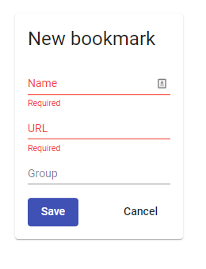
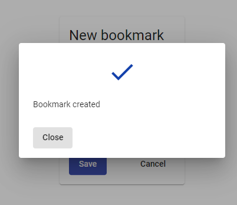
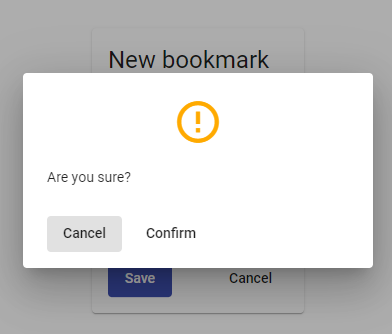

# Bookmarks

The goal of this project is manage bookmarks. You can add or delete which you want.

I have used NGRX Store so as to can manage bookmarks state. 

Also, I included "error" property in store state to be able to log the last error and I installed NGRX store dev tols to help debugging.

I have created 3 components:

- BookmarkListComponent and BookmarkTableComponent are two components which show you the bookmarks state.
- BookmarkFormComponent is used to create bookmarks.

In BookmarkFormComponent, I have used ReactiveForms to validate bookmark data.

In BookmarkListComponent, I added the bookmark delete button.

In shared folder, I created a component which is used in multiple components. 

It is ModalInfoComponent and using it you can show a confirm or succes dialog changing parameters.

#### Success

##### Cancel 

## Instructions

To start the project you have to run these commands:

`npm install`

`yarn start`
