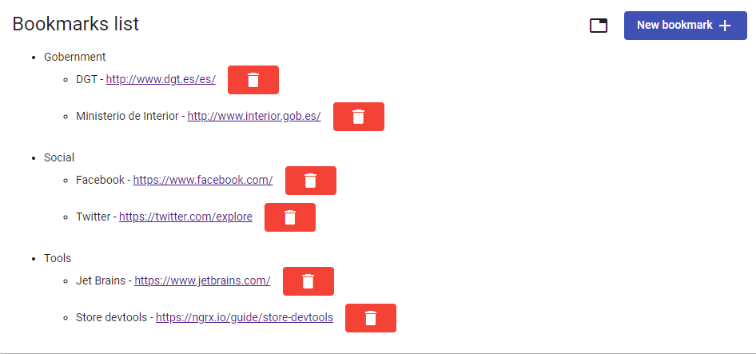
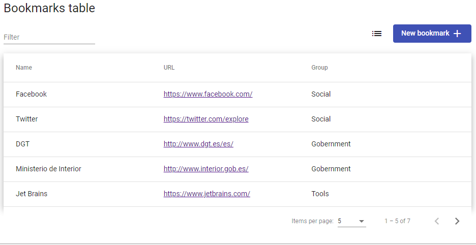
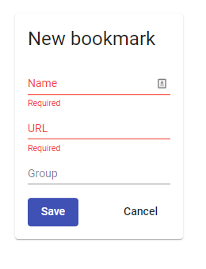
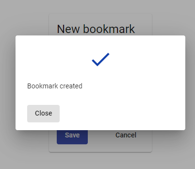
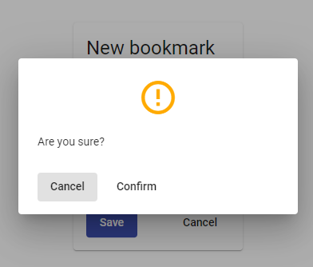

# Bookmarks

The goal of this project is manage bookmarks. You can add or delete which you want

In AppComponent, I initialize the store so as to can see information at the begining

In shared folder, I created a component which is used in multiple components

## Bookmarks list

## Bookmarks table

## Bookmark form

#### Validation

#### Save

#### Cancel 

#Instructions
To start the project you have to run de command
`yarn start` or `ng serve`
